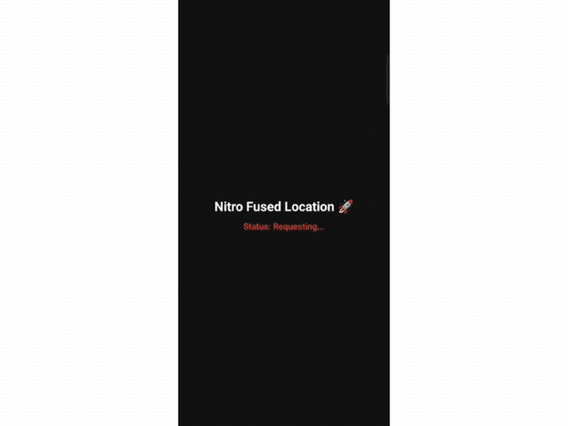

# react-native-nitro-fused-location 🚀

`react-native-nitro-fused-location` is a blazing-fast, cross-platform location module for React Native built using **Nitro Modules** for zero-bridge overhead. 

It provides ultra-fast location fetching, continuous background tracking, and native reverse geocoding without relying on external paid APIs like Google Maps.

[](https://www.npmjs.com/package/react-native-nitro-fused-location)
[](https://www.npmjs.com/package/react-native-nitro-fused-location)

---

## 📋 Requirements

- React Native v0.76.0 or higher
- Node 18.0.0 or higher

## ✨ Features

*   **⚡️ Ultra Fast:** Built with React Native Nitro Modules (C++ bindings) for zero-bridge overhead.
*   **🆓 Zero Dependencies:** No Google Maps API required. Get exact Address, City, State, Country, and Pincode natively.
*   **🌍 Fused Location Provider:** Uses highly accurate and battery-efficient location tracking on Android.
*   **📏 Native Distance Tracking:** Calculates distance (in meters) directly on iOS and Android background threads.
*   **🔄 Live Tracking:** Continuously watch user location and distance updates.
*   **📱 Cross-Platform:** Works seamlessly on both Android and iOS.
*   **🚀 Real-time Speed Monitoring: Get live speed data (m/s) without extra calculations.
*   **📍 Native Geofencing: Define custom geofence zones and monitor proximity status in
*   **🛡️ Main Thread Safe:** Optimized background execution to prevent UI freezes.
*   **✅ TypeScript Ready:** Fully typed API for a great Developer Experience (DX).
*   **🔋 Battery Efficient:** Uses Fused Location Provider + smart throttling to reduce GPS battery drain by up to 40%. 
*   **🎯 High Accuracy Modes:** Supports `PRIORITY_HIGH_ACCURACY`, `PRIORITY_BALANCED_POWER_ACCURACY`, and `PRIORITY_LOW_POWER` - pick what fits your use case. 
*   **🔐 Permission Handling Built-in:** Handles Android 13+ `FOREGROUND_SERVICE_LOCATION` and iOS `Always/WhenInUse` permissions out of the box. No boilerplate. 
*   **📦 Tiny Bundle Size:** Native module is <50KB with zero impact on your JS bundle size. 
*   **🚀 Real-time Speed Monitoring:** Get live speed data (m/s) without extra calculations.
 

 <p align="center">
  
  <br>
  <sub>Android Release Build • Cold start to 12m tracking • First fix in ~2s</sub>
</p>
> [!IMPORTANT]  
> To Support `Nitro Views`, you need to install React Native version v0.78.0 or higher.

---

## 📦 Installation

```bash
npm install react-native-nitro-fused-location react-native-nitro-modules

⚙️ Setup & Permissions
Android
Add these permissions to your android/app/src/main/AndroidManifest.xml:
```xml
<uses-permission android:name="android.permission.ACCESS_COARSE_LOCATION" />
<uses-permission android:name="android.permission.ACCESS_FINE_LOCATION" /> 
<uses-permission android:name="android.permission.ACCESS_BACKGROUND_LOCATION" />

### iOS
Add this to your `ios/YourProjectName/Info.plist`:
```xml
<key>NSLocationWhenInUseUsageDescription</key>
<string>We need your location to fetch the current address.</string>
<key>NSLocationAlwaysAndWhenInUseUsageDescription</key>
<string>We need your location to track distance in the background.</string>
<key>NSLocationAlwaysUsageDescription</key>
<string>We need your location to track distance in the background.</string>
<key>UIBackgroundModes</key>
<array>
  <string>location</string>
</array>

### Step 2: Usage Section
```md

💻 Usage (Pull to Refresh & Live Tracking)
Here is a complete example of how to use the library with continuous tracking, distance calculation, and a pull-to-refresh UI.

```tsx 
import React, { useEffect, useState, useRef, useCallback } from 'react';
import { 
  View, Text, StyleSheet, SafeAreaView, Alert, PermissionsAndroid, 
  Platform, ScrollView, RefreshControl, TouchableOpacity 
} from 'react-native';
import { NitroFusedLocation } from 'react-native-nitro-fused-location';

interface LocationInfo {
  latitude: number; longitude: number; accuracy: number; address: string;
  city: string; state: string; country: string; pincode: string; distance: number;
  speed: number;           // Naya field
  isInsideGeofence: boolean; // Naya field
}

type StatusType = 'Requesting...' | 'Checking GPS...' | 'Watching...' | 'Success' | 'Failed' | 'Denied' | 'Stopped';

function App(): React.JSX.Element {
  const [location, setLocation] = useState<LocationInfo | null>(null);
  const [status, setStatus] = useState<StatusType>('Requesting...');
  const [refreshing, setRefreshing] = useState(false);
  const watchIdRef = useRef<string | null>(null);

  const checkGpsAndStart = async () => {
    setStatus('Checking GPS...');
    const isEnabled = await NitroFusedLocation.isGpsEnabled();
    if (!isEnabled) {
      setStatus('Failed');
      return false;
    }
    startWatching();
    return true;
  };

  const startWatching = async () => {
    setStatus('Watching...');
    try {
      // Start watching and receive the updated LocationInfo object
      const id = await NitroFusedLocation.watchPosition((loc) => {
        setLocation(loc);
        setStatus('Success');
      });
      watchIdRef.current = id;
    } catch (err) {
      setStatus('Failed');
    }
  };

  const onRefresh = useCallback(async () => {
    setRefreshing(true);
    if (watchIdRef.current) {
        await NitroFusedLocation.clearWatch(watchIdRef.current);
        watchIdRef.current = null;
    }
    await checkGpsAndStart();
    setRefreshing(false);
  }, []);

  useEffect(() => {
    // 1. Geofence setup (Dynamic coordinates)
    NitroFusedLocation.setGeofence(28.8314, 78.7660, 500);

    // 2. Permission and Start
    if (Platform.OS === 'android') {
        PermissionsAndroid.request(PermissionsAndroid.PERMISSIONS.ACCESS_FINE_LOCATION).then(() => {
            checkGpsAndStart();
        });
    } else {
        checkGpsAndStart();
    }

    return () => {
      if (watchIdRef.current) NitroFusedLocation.clearWatch(watchIdRef.current);
    };
  }, []);

  return (
    <SafeAreaView style={styles.container}>
      <ScrollView 
        contentContainerStyle={styles.content}
        refreshControl={<RefreshControl refreshing={refreshing} onRefresh={onRefresh} tintColor="#00ffcc" />}
      >
        <Text style={styles.title}>Nitro Fused Location 🚀</Text>
        <Text style={[styles.status, { color: status === 'Success' ? '#00ffcc' : '#ff4444' }]}>
          Status: {status}
        </Text>
        
        {location && (
          <View style={styles.locationBox}>
            <Text style={styles.label}>📍 Address: {location.address}</Text>
            <Text style={styles.label}>🏙 City: {location.city}</Text>
            <Text style={styles.label}>🗺 State: {location.state}</Text>
            <Text style={styles.label}>🇮🇳 Country: {location.country}</Text>
            <Text style={styles.label}>📮 Pincode: {location.pincode}</Text>
            
            <View style={styles.divider} />
            
            <Text style={styles.distanceLabel}>📏 Total Distance: {location.distance.toFixed(2)}m</Text>
            <Text style={styles.speedLabel}>⚡ Speed: {location.speed.toFixed(1)} m/s</Text>
            <Text style={[styles.geoLabel, { color: location.isInsideGeofence ? '#00ffcc' : '#ffaa00' }]}>
              🏠 Geofence: {location.isInsideGeofence ? 'Inside' : 'Outside'}
            </Text>
            
            <View style={styles.divider} />
            <Text style={styles.coords}>Lat: {location.latitude.toFixed(6)} | Lng: {location.longitude.toFixed(6)}</Text>
            
            <View style={styles.buttonRow}>
              <TouchableOpacity style={styles.resetButton} onPress={async () => {
                await NitroFusedLocation.resetDistance();
              }}><Text style={styles.buttonText}>Reset Distance</Text></TouchableOpacity>
              
              <TouchableOpacity style={styles.stopButton} onPress={async () => {
                if (watchIdRef.current) {
                  await NitroFusedLocation.clearWatch(watchIdRef.current);
                  watchIdRef.current = null;
                  setStatus('Stopped');
                }
              }}><Text style={styles.buttonText}>Stop Tracking</Text></TouchableOpacity>
            </View>
          </View>
        )}
      </ScrollView>
    </SafeAreaView>
  );
}

const styles = StyleSheet.create({
  container: { flex: 1, backgroundColor: '#111' },
  content: { flexGrow: 1, justifyContent: 'center', padding: 20 },
  title: { fontSize: 24, color: 'white', fontWeight: 'bold', textAlign: 'center' },
  status: { fontSize: 16, textAlign: 'center', marginTop: 10, fontWeight: '600' },
  locationBox: { marginTop: 25, padding: 20, backgroundColor: '#1e1e1e', borderRadius: 12, borderWidth: 1, borderColor: '#333' },
  label: { fontSize: 15, color: '#e0e0e0', marginVertical: 4 },
  distanceLabel: { fontSize: 18, color: '#00ffcc', fontWeight: 'bold', marginVertical: 5, textAlign: 'center' },
  speedLabel: { fontSize: 16, color: '#ffcc00', fontWeight: 'bold', marginVertical: 5, textAlign: 'center' },
  geoLabel: { fontSize: 16, fontWeight: 'bold', marginVertical: 5, textAlign: 'center' },
  divider: { height: 1, backgroundColor: '#333', marginVertical: 15 },
  coords: { fontSize: 12, color: '#777', textAlign: 'center' },
  buttonRow: { flexDirection: 'row', justifyContent: 'space-between', marginTop: 20 },
  resetButton: { backgroundColor: '#4488ff', paddingVertical: 12, borderRadius: 8, flex: 0.48 },
  stopButton: { backgroundColor: '#ff4444', paddingVertical: 12, borderRadius: 8, flex: 0.48 },
  buttonText: { color: 'white', fontSize: 14, fontWeight: 'bold', textAlign: 'center' },
});

export default App;

### Step 3: Local Development & Footer
```md
## 🛠️ Local Development 

1. **Start Metro:** `npm start`
2. **Build Android:** `npm run android`
3. **Build iOS:**
   ```bash
   bundle install
   bundle exec pod install
   npm run ios 
   
   📖 API Reference
   ```API

    ## 📖 API Reference

### Methods

| Method | Returns | Description |
| :--- | :--- | :--- |
| `isGpsEnabled()` | `Promise<boolean>` | Checks if location services are enabled on the device. |
| `getCurrentLocation()` | `Promise<LocationData>` | Fetches the current location once. |
| `watchPosition(callback)` | `Promise<string>` | Subscribes to location updates and native distance calculation. Returns a `watchId`. |
| `clearWatch(watchId)` | `Promise<void>` | Stops watching location updates for the given ID. |
| `resetDistance()` | `Promise<void>` | Resets the natively calculated distance tracker to 0.00m. |
| `setGeofence(lat, lng, radius)` | Promise<void> | Sets a target geofence (in meters) to track proximity.

### `LocationData` Object (Return Type)

When you fetch or watch a location, the promise/callback returns this object:

| Property    | Type     | Description                                      |
| :---------- | :------- | :----------------------------------------------- |
| `latitude`  | `number` | GPS Latitude.                                    |
| `longitude` | `number` | GPS Longitude.                                   |
| `accuracy`  | `number` | Location accuracy in meters.                     |
| `address`   | `string` | Full formatted address (Reverse Geocoded).       |
| `city`      | `string` | City name.                                       |
| `state`     | `string` | State or administrative area.                    |
| `country`   | `string` | Country name.                                    |
| `pincode`   | `string` | Postal code / Zip code.                          |
| `distance`  | `number` | Total distance traveled in meters (since start). |
| `speed`.    | `number` | Current speed in meters per second (m/s).        |
| `isInsideGeofence`| boolean | Returns true if user is within the defined geofence radius.|  

Credits
Bootstrapped with create-nitro-module. 

💖 Support My Work
If this library helped you save time or you find it useful, please consider sponsoring me. Your support helps me maintain this library and build more open-source tools! 

## License

MIT © [Upendra Singh]
